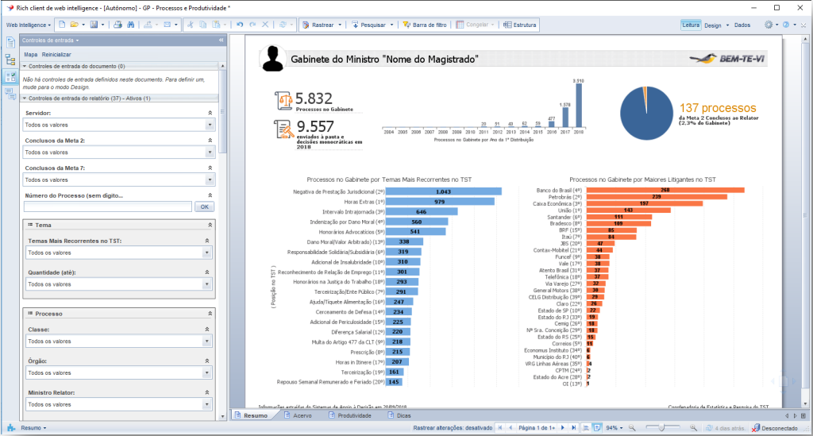

# Justiça do trabalho e projetos de IA

## O que é a Justiça do trabalho?

A Justiça do Trabalho concilia e julga as ações judiciais entre trabalhadores e empregados e outras contravésias decorrentes da relação de trabalho, igual demandas originadas no cumprimento de suas próprias sentenças, inclusive as coletivas.

>Nos termos previstos pelo art. 114 da Constituição Federal, a Justiça do Trabalho é responsável por processar e julgar: as ações oriundas da relação de trabalho, abrangidos os entes de direito público externo e da administração pública direta e indireta da União, dos Estados, do Distrito Federal e dos Municípios; As ações que envolvam exercício do direito de greve; as ações sobre representação sindical, entre sindicatos, entre sindicatos e trabalhadores, e entre sindicatos e empregadores; os mandados de segurança, habeas corpus e habeas data, quando o ato questionado envolver matéria sujeita à sua jurisdição; os conflitos de competência entre órgãos com jurisdição trabalhista, ressalvado o disposto no art. 102, I, o; as ações de indenização por dano moral ou patrimonial, decorrentes da relação de trabalho; as ações relativas às penalidades administrativas impostas aos empregadores pelos órgãos de fiscalização das relações de trabalho; a execução, de ofício, das contribuições sociais previstas no art. 195, I, a, e II, e seus acréscimos legais, decorrentes das sentenças que proferir e outras controvérsias decorrentes da relação de trabalho, na forma da lei.

Os órgãos da Justiça do Trabalho são o Tribunal Superior do Trabalho (TST), os Tribunais Regionais do Trabalho (TRTs) e os Juízes do Trabalho. Os Juízes do Trabalho atuam nas `Varas do Trabalho` e formam a `1ª instância da Justiça do Trabalho`. Existem 24 TRTs que são compostos por `Desembargadores` que representam a `2ª instância da Justiça do Trabalho`.

Todos os envolvidos na relação trabalho <--> empregado podem recorrer à Justiça do Trabalho, em Busca de reparação dos prejuízos de duas formas:

- *Reclamação escrita*: Como o auxílio de um advogado ou sindicato;
- *Reclamação verbal*: dirigindo-se a uma __Vara do Trabalho__, ao Setor de Atermação e Reclamação, para apresentar documentos pessoais ou outros que permitam a comprovação do que foi alegado.

## Como é o andamento de processos na Justiça do Trabalho

- *Dissídios Individuais*:
    1. A reclamação trabalhista é distribuída a uma __Vara do Trabalho__. O Juiz, antes mesmo de analisar a demanda, propõe uma conciliação entre as partes. Assim determina a lei.
    2. Caso a negociação de errado, será analisada a questão e prolatada a sentença.
    3. Após a análise do Juiz, a sentença cabe recurso para o TRT, __2ª instância__, que o julgará em uma de suas Turmas.
    4. No TRT, a decisão (sentença) `passa a ser conhecida por acórdão`.
    5. Do `acórdão regional`, cabe recurso para o TST. é um recurso técnico que depende de uma análise prévia, pela presidência do TRT, para ser encaminhado ao TST.
    6. Há ainda, entre esses recursos, outros, conhecidos como recursos internos, tais como embargos declaratórios, embargos etc.
    7. Esgotados todos os recursos, a última decisão transita em julgado, ou seja, torna-se definitiva e irrecorrível.
    8. Após os autos do processo retornam à Vara de origem, onde tem início uma nova fase: a execução. Nessa fase são elaborados os cálculos, para que se pague o que é devido à parte vencedora.

- *Dissídios Coletivos*:
    1. Os __Dissídios__ Coletivos são ações ajuizadas pelos Sindicatos, Federações ou Confederações, para defesa dos interesses de seus filiados. Também podem ter origem no TRT, caso o regulamento da empresa tiver observância em área territorial que não exceda a jurisdição do TRT, ou no TST (originário), quando esse regulamento for de âmbito nacional.
    2. Instaurado o __Dissídio Coletivo__ no TRT, o Presidente da Corte, ou seu Vice, fará tantas reuniões conciliatórias quantas necessárias. Em não havendo acordo, esse __dissídio__ virá para o TST como Recurso Ordinário em __Dissídio Coletivo__.
    3. Instaurado no TST, ultrapassada a fase conciliatória, haverá sorteio do relator, que o levará a julgamento na Sessão Especializada em __Dissídios Coletivos__.
    4. A decisão do __Dissídio Coletivo__ que verse sobre novas condições de trabalho poderá ser estendida a todos os empregados da mesma categoria profissional, representada pelo sindicato autor, desde que compreendida na jurisdição do Tribunal.

## Projeto Bem-Te-vi

É um sistema de apoio à gestão e triagem da base de dados de processos dos gabinetes de ministros do TST, esse nome foi escolhido em homenagem à conhecida ave presente em abundância na fauna brasileira. Esse módulo do sistema oferece dezenas de opções de filtros para triagem, tais como servidor responsável, temas do processo, ano de autuação, partes recorrentes, data de chegada ao gabinete, etc. Os dados são atualizados diariamente e os relatórios podem ser salvos em formato PDF ou Excel.

Usando Big Data e Inteligência Artificial (IA), Disponibiliza aos gabinetes, informações sobre os processos de sua base de dados de forma eficiente e acessível. Possibilitando a denegação por transcendência com base nos processos já julgados pelo magistrado. O sistema começou a funcionar no TST em fevereiro de 2020.

- *Funcionamento do sistema*:
    1. fazendo inicialmente a extração do conteúdo das peças processuais mais relevates de um processo, dos sistemas jurídicos internos e dos Tribunais Regionais do Trabalho.
    2. É feito o tratamento apropriado para cada tipo e base de dados. Os dados são coletados, transformados e armazenados utilizando Big Data.
    3. Os textos tratados são utilizados como insumos para os algoritmos de aprendizado de máquina, utilizando técnicas de Processamento de Linguagem Natural que possibilita o a criação de modelos preditivos capazes de extrair informações da linguagem jurídica trabalhista.
    4. Esses modelos auxiliam os servidores na tomada de decisões, como a análise de transcendência, um critério jurídico para admissibilidade do recurso definido pela reforma trabalhista de 2017.

- *Arquitetura do sistema*:

## Projeto Sabiá

O projeto tem como objetivo desenvolver soluções tecnológicas para complementar o sistema Bem-Te-Vi no que se refere às funcionalidades de Agrupamento de Processos e Levantamento de Jurisprudência. Bem-Te-Vi ja está sendo utilizado pelo TST para a classificação e agrupamento de processos trabalhistas similares com a ajuda de ML usando PLN. Esse processo ajuda os Juizes na tomada de decisão e padronização dos recuros, decisões e acórdãos.

Hoje governo federal brasileiro exitem algumas leis e decretos que viabilizam e incentivam a criação dessas novas tecnologias visando a melhoria do sistema Judiciário nacional.

Eficiência organizacional, Decreto nº 9.739 / 2019, que visa à administração pública federal ampliar e tratar o arranjo institucional do Sistema de Inovação do Governo Federal;

- Rede Nacional de Governo Digital, Decreto nº 9.584 / 2018, para promover a colaboração, o intercâmbio e a criação de iniciativas inovadoras relacionadas ao governo digital no setor público;

- Transformação digital, Decreto nº 9.319 / 2018 que institui o Sistema Nacional para a Transformação Digital e estabelece a estrutura degovernança para a implantação da Estratégia Brasileira para a Transformação Digital.

- Responsividade, Decreto nº 9.203 / 2017 que dispõe sobre a política de governança da administração pública federal;

- Remoção de formalidades e soluções tecnológicas para simplificar o processo cidadão-cliente, Lei Nacional 13.460 / 2017;

- Incentivo ao desenvolvimento científico, pesquisa, capacitação e inovação científica e tecnológica (“Lei de Inovação”), Lei Nacional 13.243/ 2016;

- Política de governança digital, Decreto nº 8.638 / 2016, que institui a Política de Governança Digital no âmbito da Administração Pública Federal.

## Dicionário

- [Vara do trabalho.](https://pt.wikipedia.org/wiki/Vara_do_Trabalho)
- [1ª instância da Justiça do Trabalho.](https://www.tst.jus.br/web/acesso-a-informacao/varas-do-trabalho#:~:text=A%20Vara%20do%20Trabalho%20%C3%A9,na%20forma%20de%20Reclama%C3%A7%C3%A3o%20Trabalhista.)
- [2ª instãncia da Justiça do Trabalho.](https://www.cnmp.mp.br/portal/institucional/476-glossario/8009-instancia#:~:text=A%20segunda%20inst%C3%A2ncia%2C%20onde%20s%C3%A3o,dos%20tribunais%20de%20segunda%20inst%C3%A2ncia.)
- [Desembargadores.](https://pt.wikipedia.org/wiki/Desembargador)
- [Passa a ser conhecida por acórdão.](https://www.cnj.jus.br/cnj-servico-saiba-quando-a-decisao-final-e-dada-por-sentenca-ou-em-acordao/)
- [Acórdão regional.](https://pt.wikipedia.org/wiki/Ac%C3%B3rd%C3%A3o#:~:text=Ac%C3%B3rd%C3%A3o%20%C3%A9%20a%20decis%C3%A3o%20do,ou%20ministro%20de%20tribunais%20%E2%80%94%20estes%2C)

## Links externos

- [Organograma TRT 2ª Região.](https://ww2.trt2.jus.br/fileadmin/estrutura/20230424_organograma_2023.pdf)
- [mapa sites dos TRTs para todas às 24 regiões.](https://www.tst.jus.br/justica-do-trabalho)
- [Quem é quem (mapa de cargos e suas repesctivas ocupações).](https://www.tst.jus.br/web/guest/quem-e-quem)
- [Organograma TST.](https://www.tst.jus.br/documents/10157/1628486/ORGANOGRAMA+ATUAL+-+11-4-2023.pdf/c9f85390-6b0f-46c2-8354-5069870c3eb5?t=1681387918250)
- [Estratégia de TI TST.](https://www.tst.jus.br/web/guest/estrategia-de-ti)
- [Manual bem-te-vi.](https://www.tst.jus.br/documents/18640430/24708373/Manual+do+usu%C3%A1rio+Bem-Te-Vi/7c2b006a-fc28-6ca1-438f-c47eb514e4bf)
- [Plano de trabalho UNB.](http://dpi.unb.br/images/Decreto10.426.20_documentosassinados_DPA/23106.0995082021-15/SEI_UnB_-_7424903_-_Plano_de_trabalho_-_com_recursos_financeiros.pdf)
- [CSTJ - Justiça 4.0 - bem-te-vi.](https://www.csjt.jus.br/web/csjt/justica-4-0/bem-ti-vi)
- [TECNOLOGIA APLICADA À GESTÃO DOS CONFLITOS NO ÂMBITO DO PODER JUDICIÁRIO BRASILEIRO.](https://conhecimento.fgv.br/sites/default/files/2022-08/publicacoes/estudos_e_pesquisas_ia_1afase.pdf)
