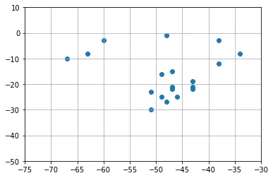
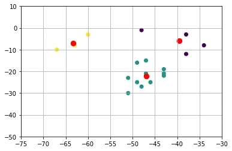

# K-means (k-means clustering)

## O que é o k-means

Em [mineração de dados](https://pt.wikipedia.org/wiki/Minera%C3%A7%C3%A3o_de_dados), agrupamento **k-means** é um método de segregar(agrupar) em torno de centros (centroides) diversos dados, criando o que analogamente na química chamamos de [clustering](https://pt.wikipedia.org/wiki/Clustering) que gera o efeito de particionar n observações dentre k grupos onde cada observação pertence ao grupo mais próximo da média. Isso resulta em uma divisão do espaço de dados em um [Diagrama de Voronoi.](https://pt.wikipedia.org/wiki/Diagrama_de_Voronoi)

O problema é computacionalmente difícil ([NP-difícil](https://pt.wikipedia.org/wiki/NP-dif%C3%ADcilhttps://pt.wikipedia.org/wiki/NP-dif%C3%ADcil)), no entanto, existem algoritmos heurísticos eficientes que são comumente empregados e convergem rapidamente para um [local optimum.](https://pt.wikipedia.org/wiki/Local_optimum) Estes são geralmente semelhantes ao algoritmo de maximização da expectativa para misturas de distribuições gaussianas através de uma abordagem de refinamento iterativo utilizado por ambos os algoritmos. Além disso, ambos usam os centros de clusters para modelar dados, no entanto, a clusterização k-means tende a encontrar clusters de extensão espacial comparáveis enquanto o mecanismo de maximização da expectativa permite ter diferentes formas.

Esse algoritmo está disponível em bibliotecas, exemplo [Scikit-Learn.](https://scikit-learn.org/).

É um algoritmo de aprendizado não supervisionado (ou seja, que não precisa de inputs de confirmação externos) que avalia e clusteriza os dados de acordo com suas características, como por exemplo:

- Lojas/centro logistico
- Clientes/produtos ou serviços semelhantes
- Clientes/características semelhantes
- Séries/gênero da série ou faixa etaria
- Usuarios de uma rede social/usuário influenciados
- Paciente/sintoma ou característica semelhantes

Por exemplo, uma rede de lojas com abrangência nacional deseja saber qual seria os melhores lugares para contruir os centros logísticos de abastecimento?

Uma forma de responder isso com K-means seria:

1. Precisamos definir um "K", ou seja, um número de clusters (agrupamentos).
2. Precisamos definir, aleatoriamente, um centroide para cada cluster.
3. Calcular, para cada ponto, o centroide de menor distância. Cada ponto pertencerá ao centroide mais próximo (lembrar do exemplo do CD logístico e das lojas: cada loja (ponto) deve ser atendida pelo CD(centróide) mais próximo).
4. Reposicionar o centróide. A nova posição do centroide deve ser a média da posição de todos os pontos do cluster.
5. Os dois últimos passos são repetidos, interativamente, até obtermos a posição ideal dos centróides.

## História

O termo "k-means" foi empregado primeiramente por James MacQueen em 1967, embora a ideia remonta a Hugo Steinhaus em 1957. O "Standard algorithm" foi proposto primeiramente por Stuard Lloyd em 1957 como uma técnica para modulação por código de pulso, embora não essencialmente o mesmo método, é por isso que é por vezes referido também como Lloyd-Forgy. Uma versão mais eficiente foi proposta e publicada em Fortran por Hartigan e Wong, no período entre 1975 e 1979.

fonte: [k-means - Wikipédia.](https://pt.wikipedia.org/wiki/K-means)

## Utilizando no Python

Exemplo: A rede de lojas Bruno tem 19 lojas em algumas das principais cidades do país. A empresa pensa em construir 3 centros logísticos para abastecer as lojas. Mas, qual seria a posição ótimas para cada um desses três hubs, considerando apenas a posição (coordenadas geográficas) das lojas?

Abaixo, plotamos no gráfico a representação em coordenadas de cada uma das 19 cidades onde a rede possui filiais.

```python
import numpy as np #para manipular os vetores
from matplotlib import pyplot as plt #para plotar os gráficos
from sklearn.cluster import KMeans #para usar o KMeans

dataset = np.array(
#matriz com as coordenadas geográficas de cada loja
[[-25, -46], #são paulo
[-22, -43], #rio de janeiro
[-25, -49], #curitiba
[-30, -51], #porto alegre
[-19, -43], #belo horizonte
[-15, -47], #brasilia
[-12, -38], #salvador
[-8, -34], #recife
[-16, -49], #goiania
[-3, -60], #manaus
[-22, -47], #campinas
[-3, -38], #fortaleza
[-21, -47], #ribeirão preto
[-23, -51], #maringa
[-27, -48], #florianópolis
[-21, -43], #juiz de fora
[-1, -48], #belém
[-10, -67], #rio branco
[-8, -63] #porto velho])
plt.scatter(dataset[:,1], dataset[:,0]) #posicionamento dos eixos x e y
plt.xlim(-75, -30) #range do eixo x
plt.ylim(-50, 10) #range do eixo y
plt.grid() #função que desenha a grade no nosso gráfico
```

O ponto mais ao sul no gráfico representa Porto Alegre, o ponto mais à Oeste representa Rio Branco, o ponto mais à leste representa Recife e o ponto mais ao norte representa Belém.



Usando o algoritmo KMeans, do **Scikit-Learn** para agrupar as nossas filiais em 3 grupos. Cada grupo será servido por um centro logístico, que será representado por um centróide (os pontos em vermelho no gráfico).

```python
kmeans = KMeans(n_clusters = 3, #numero de clusters
init = 'k-means++', n_init = 10, #algoritmo que define a posição dos clusters de maneira mais assertiva
max_iter = 300) #numero máximo de iterações
pred_y = kmeans.fit_predict(dataset)
plt.scatter(dataset[:,1], dataset[:,0], c = pred_y) #posicionamento dos eixos x e y
plt.xlim(-75, -30) #range do eixo x
plt.ylim(-50, 10) #range do eixo y
plt.grid() #função que desenha a grade no nosso gráfico
plt.scatter(kmeans.cluster_centers_[:,1],kmeans.cluster_centers_[:,0], s = 70, c = 'red') #posição de cada centroide no gráfico
plt.show()
```


